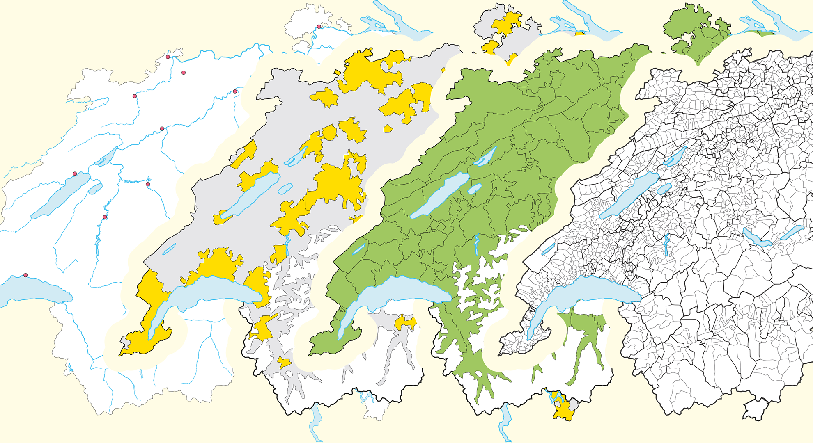
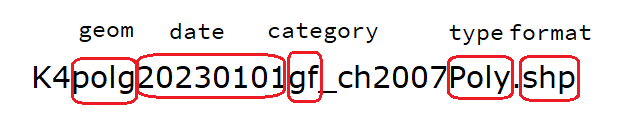

## What's the plan for today?

1.  Access official geographic databases
2.  Join your own data to geographic datasets
3.  Create customized interactive maps (of Switzerland[^1])

[^1]: This workflow could be reused for any geographic area.

Get all the R code of this talk: [felixluginbuhl.com/talks](https://felixluginbuhl.com/talks/)

## About me

-   Currently supporting the R tranformation of the Statistical Office of St.Gallen.
-   Worked 2 years as Data Scientist at the Global Fund.
-   Background in social sciences (Master in Sociology and Master in European Studies from the University of Geneva).

**Disclamer**: I am a self-trained R mapper![^2]

[^2]: if I did it, so can you.

Online presence: [felixluginbuhl.com](https://felixluginbuhl.com/), [github.com/lgnbhl](https://github.com/lgnbhl).

## How to access geodata?

International level:

-   The [Natural Earth Project](https://www.naturalearthdata.com/) (public domain).

European level:

-   [Gisco](https://ec.europa.eu/eurostat/web/gisco): Eurostat Mapping API.

Country level (Switzerland):

-   Swiss national geoportal ([geo.admin.ch](https://www.geo.admin.ch/en))
-   Official Thematic Base Maps ([ThemaKart](https://www.bfs.admin.ch/bfs/en/home/statistics/regional-statistics/base-maps/cartographic-bases.assetdetail.24025646.html))

## International geodata

Get world data from the *Natural Earth* Project.

```{r, .smaller}
#| echo: true
#install.packages("rnaturalearth")
library(rnaturalearth)
library(ggplot2)
library(sf)

world <- ne_countries(returnclass = "sf")

ggplot(world) +
  geom_sf() +
  theme_minimal()
```

## International geodata

You also can access physical geodata with `ne_download()`.

```{r}
#| echo: true
rivers50 <- ne_download(
  scale = 50,
  type = "rivers_lake_centerlines",
  category = "physical",
  returnclass = "sf")

ggplot(rivers50) +
  geom_sf() +
  theme_minimal()
```

## International geodata

Get national data with "country" argument ("geounit" for metropolitan only):

```{r}
#| echo: true
swiss <- ne_countries(
  country = "switzerland", 
  scale = 10, #1:10m 
  returnclass = "sf")

ggplot(swiss) +
  geom_sf() +
  theme_minimal()
```

## International geodata

Get "state" (cantonal) level data with `ne_states()`.

```{r}
#| echo: true
swiss_cantons <- ne_states(
  country = "switzerland", 
  returnclass = "sf")

ggplot(swiss_cantons) +
  geom_sf() +
  theme_minimal()
```

## European geodata

Access Eurostat Mapping API.

```{r}
#| echo: true
library(giscoR)
library(ggplot2)

switzerland_sf <- gisco_get_nuts(
  country = "Switzerland", 
  nuts_level = 3, #Counties/provinces/districts
  resolution = "01") #1:1million

ggplot(switzerland_sf) +
  geom_sf() +
  theme_minimal()
```

## Switzerland geodata

Swiss national geoportal (Swiss Stac API) with `bfs_get_catalog_geodata()`.

```{r}
#| echo: true
library(BFS)
library(dplyr) # for glimpse()

#bfs_download_geodata() #download by collection_id
bfs_get_catalog_geodata(include_metadata = FALSE) |> glimpse()
```

## Switzerland geodata

::: columns
::: {.column width="40%"}
The ThemaKart project gives access to various thematic maps.


:::

::: {.column width="60%"}
A typical base maps ThemaKart file looks like this:


:::
:::

## Switzerland geodata

You can access base maps files with `bfs_get_base_maps()`.

```{r}
#| echo: true
# list of geometry names: https://www.bfs.admin.ch/asset/en/24025645
switzerland_sf <- bfs_get_base_maps(geom = "suis")
communes_sf <- bfs_get_base_maps(geom = "polg", date = "20230101")
districts_sf <- bfs_get_base_maps(geom = "bezk")
cantons_sf <- bfs_get_base_maps(geom = "kant")
cantons_capitals_sf <- bfs_get_base_maps(geom = "stkt", type = "Pnts", category = "kk")
lakes_sf <- bfs_get_base_maps(geom = "seen", category = "11")
```

## Switzerland static map with ggplot2

```{r}
#| echo: true
library(ggplot2)

ggplot() + 
  geom_sf(data = communes_sf, fill = "snow", color = "grey45") + 
  geom_sf(data = lakes_sf, fill = "lightblue2", color = "black") +
  geom_sf(data = districts_sf, fill = "transparent", color = "grey65") + 
  geom_sf(data = cantons_sf, fill = "transparent", color = "black") +
  geom_sf(data = cantons_capitals_sf, shape = 18, size = 3) +
  theme_minimal() +
  theme(axis.text = element_blank()) +
  labs(caption = "Source: ThemaKart, © BFS")
```

## Joining data to Swiss geodata

Each observation of your data should be joined to a geodata spatial geometry.

The `sf` R package (for "Simple Feature") allows to do it in a tidy way.

```{r}
#| echo: true
library(BFS)

bfs_get_base_maps(geom = "kant") |> glimpse()
```

## Joining data to Swiss geodata

Let's download an official Swiss dataset with `BFS`:

```{r, results = 'hide'}
#| echo: true
#bfs_get_catalog_data() # get catalog
# Swiss dataset: https://www.bfs.admin.ch/asset/de/px-x-1502000000_101
swiss_students <- BFS::bfs_get_data(
  number_bfs = "px-x-1502000000_101", 
  language = "fr", 
  clean_names = TRUE)
```

```{r}
glimpse(swiss_students)
```

## Joining data to Swiss geodata

We can then pivot it and calculate share of female students:

```{r}
#| echo: true
library(tidyverse)

swiss_students_gender <- swiss_students |>
  filter(nationalite_categorie == "Suisse", #only Swiss students
         canton_de_lecole != "Suisse") |> #only cantonal data
  pivot_wider(names_from = sexe, values_from = eleves_et_etudiants) |>
  mutate(share_woman = round(Femme/`Sexe - Total`*100, 1))

glimpse(swiss_students_gender)
```

## Joining data to Swiss geodata

We can then joining our data to the geodata.

```{r}
#| echo: true
swiss_map <- bfs_get_base_maps(geom = "kant")

dplyr::setdiff(swiss_map$name, unique(swiss_students_gender$canton_de_lecole))
```

## Joining data to Swiss geodata

We need to do some recoding before the left join.

```{r}
#| echo: true
swiss_student_map <- swiss_students_gender %>%
  filter(canton_de_lecole != "Schweiz") %>% # remove national level
  mutate(canton_de_lecole = str_remove(canton_de_lecole, ".*/"),
         canton_de_lecole = str_trim(canton_de_lecole),
         canton_de_lecole = recode(canton_de_lecole, "Berne" = "Bern", "Freiburg" = "Fribourg", "Grischun" = "Graubünden", "Ticino" = "Tessin", "Wallis" = "Valais")) |>
  left_join(swiss_map, by = c("canton_de_lecole" = "name")) |>
  select(canton_de_lecole, annee, degre_de_formation, share_woman, geometry)

glimpse(swiss_student_map)
```

## Joining data to Swiss geodata

To ease your work with geodata names, I provided the Swiss official registers.

```{r}
#| echo: true
library(BFS)
#register_bzn, register_dic, register_kt, register_kt_seeanteile
bfs_get_base_maps(geom = "polg", date = "20230101") |>
  inner_join(BFS::register_gde |> 
               filter(GDEKTNA == "Genève"), #only Geneva communes
             by = c("id" = "GDENR")) |>
  glimpse()
```

## Interactive Maps with `mapview`

> mapview provides functions to very quickly and conveniently create interactive visualisations of spatial data. It's main goal is to fill the gap of quick (not presentation grade) interactive plotting to examine and visually investigate both aspects of spatial data, the geometries and their attributes. It can also be considered a data-driven API for the leaflet package as it will automatically render correct map types, depending on the type of the data (points, lines, polygons, raster).

Source: https://r-spatial.github.io/mapview/

## Interactive Maps with `mapview`

The easy way with `mapview` (but limited customization).

```{r}
#| echo: true
library(BFS)
library(mapview)

bfs_get_base_maps(geom = "bezk") |>
  mapview(zcol = "name", legend = FALSE)
```

## Interactive Maps with `mapview`

Using `mapview` with our Swiss students dataset.

```{r}
#| echo: true
swiss_student_map_pivoted <- swiss_student_map |>
  pivot_wider(names_from = "degre_de_formation", values_from = "share_woman") |>
  sf::st_as_sf()

swiss_student_map_pivoted |>
  filter(annee == "2022/23") |>
  mapview(zcol = "Degré de formation - Total", layer.name = "% étudiantes suisses, 2023")
```

## Interactive Maps with `mapview`

`mapview` is using *Leaflet* in the background, which allows to access extra functionality:

```{r}
#| echo: true
map_2023 <- swiss_student_map_pivoted |>
  filter(annee == "2022/23") |>
  mapview(zcol = "Degré de formation - Total", layer.name = "% étudiantes suisses, 2023")

map_2000 <- swiss_student_map_pivoted |>
  filter(annee == "1999/00") |>
  mapview(zcol = "Degré de formation - Total", layer.name = "% étudiantes suisses, 2000")
```

## Interactive Maps with `mapview`

`mapview` is using *Leaflet* in the background, which allows to access extra functionality:

```{r}
#| echo: true
library(leafsync)

sync(map_2023, map_2000)
```

## Interactive Maps with `mapview`

`mapview` is using *Leaflet* in the background, which allows to access extra functionality:

```{r}
#| echo: true
latticeView(map_2023, map_2000)
```

## Interactive Maps with `mapview`

`mapview` is using *Leaflet* in the background, which allows to access extra functionality:

```{r}
#| echo: true
map_2023 | map_2000
```

## Interactive Maps with `leaflet`

Let's reproduce this [*datawrapper* map](https://www.bfs.admin.ch/asset/en/27205601):

<iframe title="The five most frequent last names by commune¹, 2022" aria-label="Map" id="datawrapper-chart-16EcY" src="https://datawrapper.dwcdn.net/d0add131f4000d30db465143ff411997/5/" scrolling="no" frameborder="0" style="width: 0; min-width: 100% !important; border: none;" height="562" data-external="1">

</iframe>

```{=html}
<script type="text/javascript">!function(){"use strict";window.addEventListener("message",(function(a){if(void 0!==a.data["datawrapper-height"]){var e=document.querySelectorAll("iframe");for(var t in a.data["datawrapper-height"])for(var r=0;r<e.length;r++)if(e[r].contentWindow===a.source){var i=a.data["datawrapper-height"][t]+"px";e[r].style.height=i}}}))}();</script>
```
## Interactive Maps with `leaflet`

Let's find the data with `bfs_get_catalog_tables()`.

```{r}
#| echo: true
tables_names <- BFS::bfs_get_catalog_tables(
  language = "en", 
  title = "last+names")

glimpse(tables_names)
```

## Interactive Maps with `leaflet`

Let's download and read the data.

```{r}
#| echo: true
asset_names_commune <- tables_names |>
  filter(str_detect(title, "commune")) |>
  pull(number_asset) |>
  head(1)

tmp <- tempfile()

BFS::bfs_download_asset(
  number_asset = asset_names_commune, 
  destfile = tmp)

df <- read_csv(file = tmp) |>
  select(-TIME_PERIOD, -OBS_STATUS)
```

## Interactive Maps with `leaflet`

Let's download and read the data.

```{r}
#| echo: true
glimpse(df)
```

## Interactive Maps with `leaflet`

Top 5 by commune by rank and percent:

```{r}
#| echo: true
df_top_5 <- df |>
  arrange(desc(PCT_GDE)) |>
  group_by(GDENAME) |>
  slice(1:5) |>
  mutate(RANK = row_number()) |> 
  ungroup()

glimpse(df_top_5)
```

## Interactive Maps with `leaflet`

Create html table for each commune

```{r}
#| echo: true
create_table <- function(name) {
  df <- df_top_5 |> 
    filter(GDENAME == name)

  table <- df |> 
    select("Rank" = RANK, "Last name" = LASTNAME, 
           "Number" = VALUE, "Percentage" = PCT_GDE) |>
    mutate(Rank = paste0(Rank, "."),
           Percentage = paste0(Percentage, "%")) |>
    kableExtra::kable(format = "html", align = "llrr")
  
  paste0(
    "<b>", unique(df$GDENAME), "</b><br>",
    table
  )
}
```

## Interactive Maps with `leaflet`

```{r}
#| echo: true
create_table(name = "Aadorf")
```

## Interactive Maps with `leaflet`

Add html table code in the `table` column.

```{r}
#| echo: true
df_with_tables <- df_top_5 |> 
  filter(RANK == 1) |>
  mutate(table = map_chr(GDENAME, create_table))
```

## Interactive Maps with `leaflet`

Get official Swiss base maps.

```{r}
#| echo: true
communes_sf <- BFS::bfs_get_base_maps(geom = "polg")
lakes_sf <- BFS::bfs_get_base_maps(geom = "seen", category = "11") |>
  sf::st_transform(crs = "+proj=longlat +datum=WGS84")
```

## Interactive Maps with `leaflet`

Join our data with geodata.

```{r}
#| echo: true
sf_communes_joined <- communes_sf |>
  left_join(df_with_tables, by = c("id" = "GDENR")) |>
  sf::st_transform(crs = "+proj=longlat +datum=WGS84")
```

## Interactive Maps with `leaflet`

Create a basic *leaflet* map.

```{r}
#| echo: true
library(leaflet)

# customize legend 
bins = c(0, 1, 2.5, 5, 10, 20, 100)
col_custom = c("#f5b3bb", "#ef8894","#e85767","#dc0018","#a60013","#73000d")
pal <- colorBin(col_custom, 
                domain = sf_communes_joined$PCT_GDE, 
                bins = bins)
legend_labels <- c("0 – 1", "1 – 2.5", "2.5 – 5", 
                   "5 – 10", "10 – 20", "20 – 100")

map <- leaflet(sf_communes_joined, height = 600, width = 900) |>
  addPolygons(
    weight = 0.3,
    opacity = 1,
    color = "white",
    fillOpacity = 1,
    fillColor = ~pal(PCT_GDE),
    label = ~lapply(table, htmltools::HTML),
  ) |>
  addPolygons(
    data = lakes_sf, 
    label = ~name,
    stroke = FALSE,
    color = "gray70"
    ) |> 
  addLegend(
    title = "Share of the most<br>common surname, in %", 
    labFormat = function(type, cuts, p) { paste0(legend_labels) },
    values = ~PCT_GDE,
    pal = pal, 
    opacity = 1
  )
```

## Interactive Maps with `leaflet`

Create a basic *leaflet* map.

```{r}
#| echo: true
map
```

## Interactive Maps with `leaflet`

Adding bounding box, empty background and fix zooming.

```{r}
#| echo: true
# get bounding box of Switzerland
bbox <- st_bbox(sf_communes_joined) |>
  as.vector()

map_final <- map |>
  addTiles(urlTemplate = "", # empty background
           options = providerTileOptions(minZoom = 8, maxZoom = 12)) |>
  setMaxBounds(lng1 = bbox[1], lat1 = bbox[2], 
               lng2 = bbox[3], lat2 = bbox[4]) |>
  leaflet.extras::setMapWidgetStyle(style = list(background = "transparent"))
```

## Interactive Maps with `leaflet`

Adding bounding box, empty background and fix zooming.

```{r}
#| echo: true
map_final
```

## Interactive Maps with `leaflet`

Add map in a card with title and legend.

```{r}
#| echo: true
library(bslib)
library(htmltools)

card <- card(
  tags$h5("The Five Most Frequent Last Names by Commune, 2022"),
  tags$i("Hover to display the five most common surnames (actual number and percentage) by commune."),
  map,
  tags$p(
    "Source: FSO – STATPOP, inspired by:", 
    tags$a("https://www.bfs.admin.ch/asset/en/27205601", 
           href = "https://www.bfs.admin.ch/asset/en/27205601")),
  tags$p("Get the R code:", 
         tags$a("felixanalytix.com",
                href = "https://felixanalytix.com")),
  min_height = 800, 
  max_height = 800
)
```

## Interactive Maps with `leaflet`

Add map in a card with title and legend.

```{r}
#| echo: true
card
```

## Any questions?

Get the R code of this talk:

- [felixluginbuhl.com/talks](https://felixluginbuhl.com/talks/)

You can contact me on LinkedIn: 

- [linkedin.com/in/FelixLuginbuhl](https://www.linkedin.com/in/FelixLuginbuhl)

Thank you for your attention!
